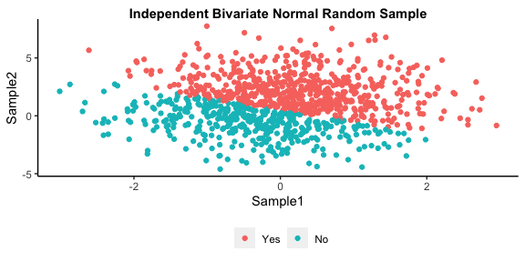

Homework1
================
Jacqueline Oakes
2/1/2022

# Problem 2.1

``` r
#create a tibble with mean and sd
normsample <- tibble(
            x = rnorm(1000, mean = 0, sd = 1),
            y = rnorm(1000, mean = 1, sd = 2))
normsample$sum_indicator <- ifelse(normsample$x + normsample$y > 0.5, TRUE, FALSE)

#use mutate to change T/F to Y/N
normsample <-  normsample %>%
   mutate(sum_indicator = as.factor(ifelse(sum_indicator == TRUE, "Yes", "No")))

#relevel so Y is before N 
normsample$sum_indicator <- forcats::fct_relevel(normsample$sum_indicator, "Yes")

#check work
view(normsample)

#create data visualization
normsample %>%
ggplot() +
  geom_point(aes(x = x, y = y, color = sum_indicator)) +
  scale_colour_discrete(
    name = "") +
  labs(x = "Sample1", y = "Sample2",
       title = "Independent Bivariate Normal Random Sample") +
    theme(plot.title = element_text(face = "bold")) +
    theme(panel.background = element_blank()) +
    theme(axis.line = element_line(colour = "black")) +
    theme(plot.title = element_text(hjust = 0.5))
```



# Problem 2

``` r
penguin.df <- read_rds("./data/penguin.RDS")

str(penguin.df)

nrow(penguin.df)

ncol(penguin.df)

#(text) what each variable is/feature describes about each observation?

mean(penguin.df$bill_length_mm, na.rm = TRUE)
sd(penguin.df$bill_length_mm, na.rm = TRUE)

mean(penguin.df$flipper_length_mm, na.rm = TRUE)
sd(penguin.df$flipper_length_mm, na.rm = TRUE)
```

-   The case definition. The Penguin dataset for each observation shows
    the size measurements for adult foraging penguins near Palmer
    Station Antarctica.
-   The number of rows is 344
-   The number of columns is 8
